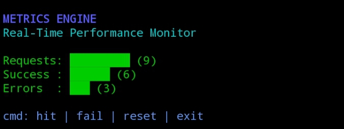

# 🔵 METRICS ENGINE

Real-Time CLI Performance Monitor  
A lightweight Node.js command-line dashboard for tracking runtime metrics.

Metrics Engine is a minimal yet structured monitoring system designed to simulate real-time request tracking, success rates, and error monitoring using an interactive CLI dashboard.

---

## 📊 Core Concept

Metrics Engine provides a clean dashboard-style interface that:

- Tracks total requests
- Tracks successful operations
- Tracks failed operations
- Displays real-time progress bars
- Allows reset and controlled shutdown

Unlike traditional log-based output, this project focuses on:

✔ Visual clarity  
✔ Structured metric presentation  
✔ Lightweight runtime  
✔ Real-time command interaction  

---

## 🚀 Features

- 🔵 Live metrics dashboard
- 🟢 Success counter tracking
- 🔴 Error counter tracking
- 📈 Dynamic progress bar rendering
- 🔄 Reset system
- 🧼 Clean UI refresh
- ⚡ Fast execution with no dependencies

---

## 🖥 Command List

| Command | Description |
|---------|------------|
| hit     | Simulate successful request |
| fail    | Simulate failed request |
| reset   | Reset all counters |
| exit    | Shutdown metrics engine |

---

## 📊 Dashboard

Live CLI metrics dashboard preview:

---

## 🧩 Project Structure

metrics/
│
├── index.js
├── package.json
├── README.md
├── SKILL.md
└── proof/
    └── dashboard.jpg

---

## 🛠 Installation

git clone https://github.com/Syawal2/metrics.git  
cd metrics  
npm install  
node index.js  

---

## ⚙ Runtime Example

metrics> hit  
metrics> hit  
metrics> fail  
metrics> reset  
metrics> exit  

---

## 🧠 Technical Highlights

- Node.js readline CLI interface
- Stateful in-memory metric tracking
- Dynamic console rendering
- ANSI color formatting
- Live dashboard refresh
- Modular command routing

---

## 🔍 System Behavior

- Each `hit` increases both request and success counters.
- Each `fail` increases request and error counters.
- `reset` clears all metrics instantly.
- The dashboard refreshes after every action.
- Exit command gracefully closes the interface.

---

## 🌐 Intercom Ecosystem Reference

This repository is structured as a modular CLI monitoring component,
following a lightweight execution model aligned with Intercom-style modular architecture.

It demonstrates real-time state updates and controlled command interaction.

---

## 🧾 Trac Wallet

trac1q0jt36v42yk33c2u925xmk72vlycuc4gf5emssjcxy224aansyjqa27k7e

---

## 🏁 Status

Active fork  
Custom dashboard implementation  
Proof included  
Ready for execution  

🔵 Metrics Engine — Clean, structured, and real-time.
